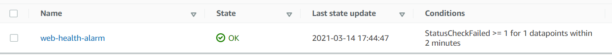
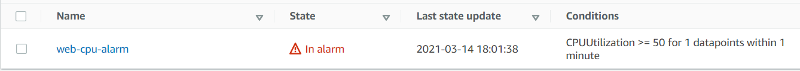
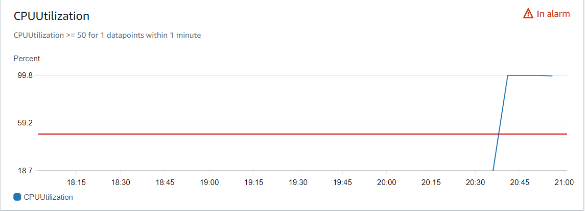

### Como rodar o projeto?
* Clone esse repositório.
* Definir o path dentro da variável key_path no arquivo `variables.tf` para se conectar na instância;
* Rodar os comandos do terraform (`terraform init`, `terraform plan`, `terraform apply`)
* Testar o acesso da página Web: http://IP:443 ou http://publicdns:443 (Página Simples usando Apache)
* Testar o acesso da página Web: http://IP:8080 ou http://publicdns:8080 (Aplicação em Node rodando em um container)
* Fazer os testes de stress e checar dentro do console da AWS o alarme;
* Rodar `terraform destroy --auto-approve`;

### Testes de Stress:
* O pacote do stress já está instalado junto ao script `Install.sh`
* Basta rodar o comando `stress -c 1 --vm 2` e acompanhar dentro do CloudWatch o Alarme em relação ao consumo de CPU;

Evidências:

